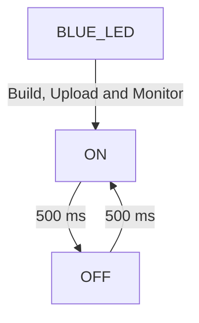
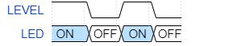

# PRACTICA 1  :  BLINK

## 1.Código Blink

'#'include<Arduino.h>

'#'define BLUE_LED 2

void setup() {

    Serial.begin(115200);
    pinMode(BLUE_LED, OUTPUT);

}

void loop() {
    
    digitalWrite(BLUE_LED, HIGH);
    Serial.println("ON");
    delay(500);

    digitalWrite(BLUE_LED, LOW);    
    Serial.println("OFF");
    delay(500);
    
}

## 2.Diagrama De Flujo

## 3.Diagrama De Tiempos

